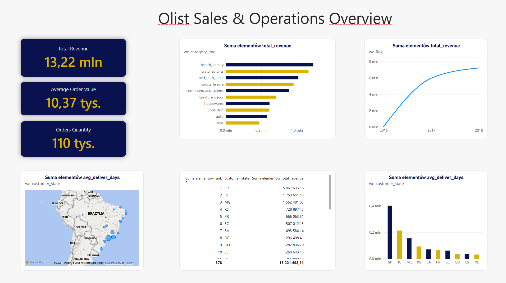
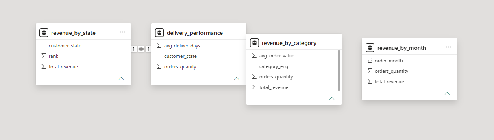

# PySpark + Databricks Lakehouse — Olist E-Commerce

A data engineering project demonstrating a medallion architecture (bronze/silver/gold) lakehouse built on Databricks, using PySpark for transformations and Power BI for the analytics layer.

The project processes the [Brazilian E-Commerce Public Dataset by Olist](https://www.kaggle.com/datasets/olistbr/brazilian-ecommerce) (~100k orders) and turns it into business-ready revenue and delivery-performance metrics.

## Overview

| | |
|---|---|
| **Source data** | Olist Brazilian E-Commerce dataset (9 raw CSV files) |
| **Platform** | Databricks Free Edition (Serverless Compute, Unity Catalog) |
| **Processing** | PySpark (DataFrame API, joins, aggregations, window functions) |
| **Storage format** | Delta Lake |
| **Visualization** | Power BI (connected live to Databricks via SQL Warehouse) |

## Architecture

```
Raw CSVs
   │
   ▼
Unity Catalog Volume  (raw file staging)
   │  spark.read.csv()
   ▼
BRONZE  (workspace.bronze.*)      — 1:1 with source CSVs, no cleaning
   │  PySpark: dedup, type casting, joins
   ▼
SILVER  (workspace.silver.orders_full)  — cleaned, joined, event-level grain
   │  PySpark: groupBy/agg, window functions
   ▼
GOLD    (workspace.gold.*)        — aggregated business metrics
   │
   ▼
Power BI Dashboard
```

**Why a layered (medallion) approach:**
- **Bronze** preserves the full raw history — you can always reprocess from source without re-reading the original CSVs.
- **Silver** is a single, reusable source of truth: cleaned, typed, and joined at the individual order-item level.
- **Gold** is optimized for specific business questions and queried directly by the dashboard.

## Tech stack and why

- **Databricks Free Edition + Serverless Compute** — zero infrastructure setup, no cluster management.
- **PySpark DataFrame API** — distributed processing, lazy evaluation, joins and window functions at scale.
- **Delta Lake** — ACID transactions, schema enforcement, tables queryable directly with SQL.
- **Unity Catalog** — governance layer for schemas (bronze/silver/gold) and raw file Volumes.
- **Power BI** — connected directly to the Databricks SQL Warehouse via Personal Access Token, Import mode.

## Project structure

```
.
├── notebooks/
│   ├── bronze_ingestion.py              # raw CSVs → Delta tables (bronze)
│   └── silver_gold_transformations.py   # cleaning, joins, aggregations (silver/gold)
├── dashboard/
│   └── olist_dashboard.pbix                # Power BI report connected to gold tables
├── docs/
│   ├── architecture.md                     # architecture notes and design decisions
│   ├── dashboard_screenshot.png
│   └── data_model_screenshot.png
└── README.md
```

## Gold layer tables

| Table | Description |
|---|---|
| `gold.revenue_by_category` | Total revenue and order count per product category |
| `gold.revenue_by_month` | Revenue trend over time |
| `gold.delivery_performance` | Average delivery time per customer state |
| `gold.revenue_by_state` | Revenue ranking by customer state (window function) |

## Dashboard

Power BI report connected directly to the Databricks gold layer (Import mode), showing revenue by category, monthly revenue trend, and delivery performance by state.



## Data model

Relationships between the imported gold tables in Power BI.



## Key challenges and decisions

- **Join fan-out**: joining `orders` with `order_items` without deduplicating on the correct grain initially inflated row counts — resolved by deduplicating each source table on its primary key before joining.
- **Delta column naming**: Delta Lake rejects column names containing spaces or special characters (`DELTA_INVALID_CHARACTERS_IN_COLUMN_NAMES`) — all aggregation aliases were standardized to `snake_case`.
- **Compute model**: Databricks Free Edition uses Serverless Compute rather than manually provisioned clusters, which simplified setup but required adjusting the workflow (no cluster creation/start-up step).

## Related project

The same dataset was previously analyzed with classic SQL + Power BI on PostgreSQL in [`sql-ecommerce-analysis`](#) — this project revisits it on a Spark/lakehouse stack to compare approaches.